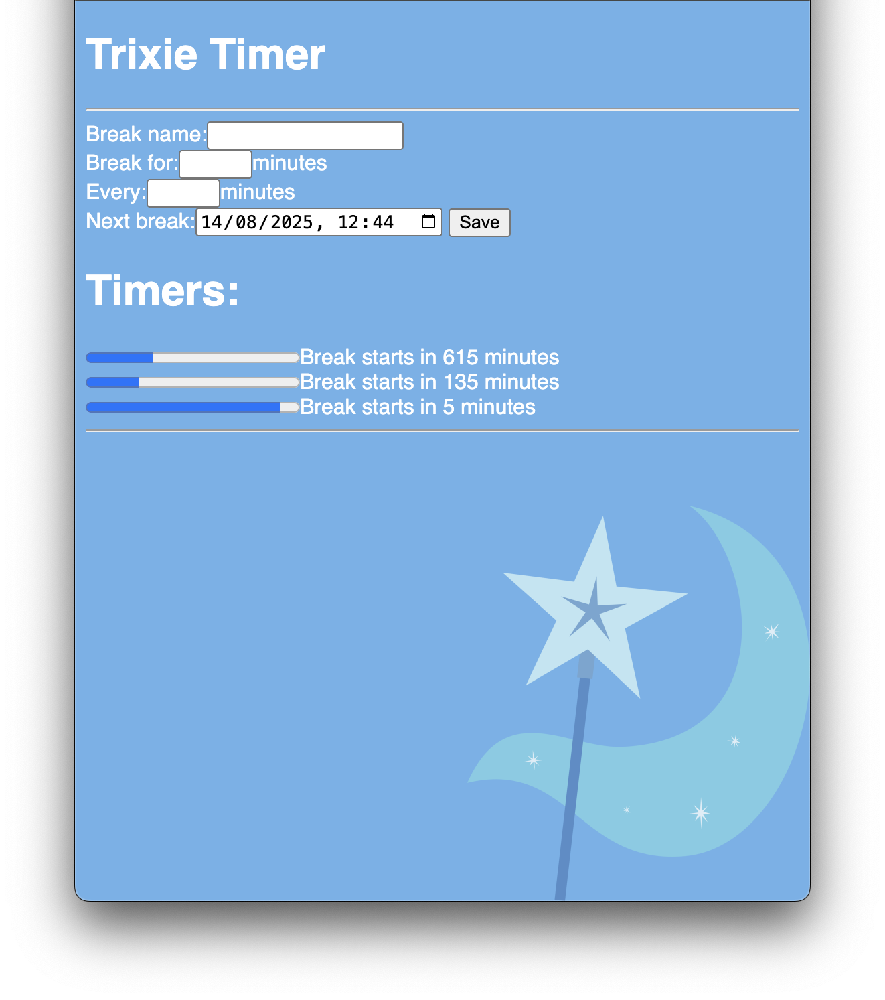

# Trixie Timer - (It's a working title)  

An alternative to "Time Out" the macOS app. However Trixie Timer is web based and therefore cross platform, furthermore there are no features locked behind paywalls.  

It is made completely using HTML CSS and JS and ran locally, no internet needed. Just download the .zip file in the releases page, extract all files to the same folder and open index.html in your web browser of choice. Downloading just index.html and opening will also work however the background image, and bells will be missing.

All code is on your device so you have the freedom to modify it however you like, the freedom to share the original or modified program with anyone and the freedom to run the program however you want. Learn more about free software [here](https://www.gnu.org/philosophy/free-sw.html#fs-definition).

Optionally access it [here](https://shania-codes.github.io/TrixieTimer/) (requires internet access).  

Imaginary use case:
User works for 3 hours and then has a 1 hour break multiple times a day, but during those 3 hours of work they work for 50 minutes and take a break for 10 minutes. This program shows when to take a break for each of those different interval and plays a sound to remind you to take a break or get back to work. The top timer in this image is a 9 hour break for sleep every 24 hours.

<!-- 
V2:
- Each time a break starts open a CS2 style case for what you are going to do during the break (Defaults: Cat-Cow stretch, Plank, Deadhang, etc...)
-->

